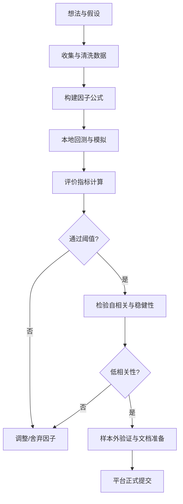

# 执行摘要  
WorldQuant（Brain/World Alpha）平台对提交的α策略有严格的评估标准，常用指标包括夏普比率、信息比率、IC、适应度（Fitness）等【6†L56-L64】【23†L291-L295】。针对600+提交、仅20+通过的情况，应从数据、信号、回测、提交流程等多方面改进：首先明确平台规则和指标阈值；其次理解并构建稳健因子（如动量、均值回归、基本面、情绪等），防止数据泄露和过拟合；然后采用严格的本地回测和参数稳健性测试，包括样本外验证、成交成本模拟；最后优化提交流程（检查自相关性、文档准备等）并批量筛选。本文综合官方文档、社区实践和学术经验，给出策略设计原则和操作流程，以及易错分析和改进建议，以帮助非金融背景用户提高Alpha通过率。  

## 1 目标与背景  
我已在WorldQuant（Brain/World Alpha）平台上传600+个Alpha公式，仅约20个有效通过，成功率不足5%。作为非金融专业人士，主要依赖AI生成因子，缺乏专业经验。可能存在的原因包括：生成因子高度自相关、回测指标不达标（如夏普、适应度过低、换手率不合格）、未做充分的局部测试或过度拟合历史数据等【6†L56-L64】【23†L291-L295】。  
**改进策略：**  
- **学习平台规则与经验阈值**：深入阅读WorldQuant官方指南、社区讨论、成功案例，明确每项指标目标（例如夏普≥2.0，适应度（Fitness）≥1.0，换手率在1%–70%【6†L56-L64】【23†L291-L295】）。  
- **因子筛选与分组**：生成新因子时同步考虑多种变体，在高相关因子之间择优，只提交最优者【6†L46-L54】【6†L88-L99】；并利用因子库（如Alpha101）和文献构思新思想。  
- **加强本地验证**：在提交前本地模拟验证各指标、自相关和行业中性化效果，避免盲目依赖AI输出结果【6†L88-L99】【6†L106-L110】。  

**立即建议：**  
- 熟读WorldQuant官方教程和提交准则（如Brain平台Help、AlphaDNA文档）；  
- 对照经验阈值评估现有因子（夏普、适应度、换手率、自相关等）；  
- 根据已通过的因子统计分布，筛除指标明显偏低的因子。  

## 2 必要信息来源（优先级）  

- **WorldQuant/World Alpha 官方文档与指南**：包括Brain/World Quant平台的帮助中心、开发者文档、FAQ等。如WorldQuant网站介绍【11†L39-L47】【11†L107-L116】和Platform平台说明。  
- **提交指南与竞赛规则**：WorldQuant国际量化挑战赛（IQC）规则、官方指南，这些文档详细说明了策略提交、评分及注意事项，例如IQC2025/2026指南（登录平台查看）。  
- **社区讨论与教程**：国内外量化社区（如知乎专栏、CSDN博客、Reddit等）分享的经验，例如“WorldQuant Brain平台Alpha提交前验证”【6†L54-L62】【6†L88-L99】、“WorldQuant Brain因子生成器”【35†L39-L47】【35†L105-L113】等。  
- **学术论文**：因子模型与业绩评估经典文献，例如Fama-French多因子模型【44†L323-L331】；因子挖掘及过拟合研究（如101 Formulaic Alphas【26†L278-L286】【26†L291-L295】、Harvey等关于多重检验的研究）。这些论文有助理解IC、IR、因子有效性、过拟合检验等。  
- **高通过率Alpha示例**：WorldQuant发布的因子或研究报告（如Kakushadze的《101 Formulaic Alphas》【26†L278-L286】【26†L291-L295】），以及GitHub社区整理的优质因子代码【26†L299-L307】【26†L317-L325】。  
- **因子库与回测工具**：开源因子库和框架，如KunQuant（支持Alpha101因子构建与加速【47†L72-L80】【47†L183-L191】）、AlphaLens、vectorbt、Backtrader等，可用于本地快速验证。  
- **其他辅助资源**：量化投资入门书籍（如《量化投资策略》）、论坛问答（如Quant.SE），其中中文资料优先引用。  

**主要参考链接（中文优先）：** 官方博客/文档（WorldQuant官网、Brain平台说明）；知乎/CSDN专栏（如WorldQuant Brain因子生成器【35†L39-L47】【35†L105-L113】）；学术论文（《101公式化Alpha》【26†L278-L286】【26†L291-L295】）；开源项目（KunQuant因子库【47†L72-L80】）。  

## 3 平台通过标准与评估指标  

WorldQuant评估一个Alpha质量时，综合考虑多个指标：  

- **夏普比率（Sharpe Ratio）**：衡量策略风险调整后收益稳定性【26†L278-L286】。平台按年化计算：`Sharpe = √252*(平均日收益/收益标准差)`【26†L278-L286】。一般要求：*Delay-1*策略Sharpe>1.25，*Delay-0* Sharpe>2.0【6†L56-L62】【23†L291-L295】。目标准则：越高越好，优秀策略可见Sharpe≥2.0【26†L291-L295】【23†L291-L295】。  
- **信息比率（IR）**：通常指平均IC与IC标准差之比（年化），衡量Alpha预测能力的稳定程度。IC（Information Coefficient）本质为因子预测值与实际后续收益的相关系数，常用秩相关。正IC意味着预测有效。一般要求IR尽可能高，经验上IR>0.5视为较好。由于公式可类比Sharpe，由论文“101因子”定义，IR与Sharpe类似，只是基于截面相关而非组合收益。  
- **适应度（Fitness）**：WorldQuant平台特有的综合评分指标，考虑到收益、波动、交易成本等。大致计算为`Fitness = Sharpe * sqrt((1 – Turnover)^x)`（Turnover对Fitness有处罚作用），具体见平台文档或实践【23†L291-L295】【22†L23-L32】。经验上Fitness>1.0是提交标准【23†L291-L295】。  
- **年化收益率（Returns）**：策略总收益的年化形式。在Brain平台，通常计算为年化PnL除以本金一半（平台Booksize是本金的2倍）【20†L44-L50】。要求越高越好，但须与风险指标综合考虑。  
- **换手率（Turnover）**：衡量交易频繁程度。一般定义为每日平均成交额D与总头寸规模I之比【26†L278-L286】。要求介于1%–70%【6†L56-L62】；过高导致交易成本上升，影响Fitness。实践中，Turnover<30%较为理想【23†L291-L295】。  
- **回测稳定性**：指长期（不同市场环境）回测结果一致性，可用滚动回测、K折交叉验证检验。无固定阈值，但需要确保策略非偶然走强。通常要求样本内（in-sample）与样本外（out-of-sample）表现相近，自相关不过度。  
- **最大回撤（Max Drawdown）**：资本峰值到谷底的最大跌幅。数值越小越好。一般控制在20%以内较安全（具体依策略不同）。  
- **风险敞口与中性化**：Alpha提交时需要中性化处理（市场中性或行业中性）【10†L118-L126】。中性化后的Beta接近0更稳健。目标通常是市场中性或指定行业/板块中性。  
- **仓位约束（Truncation/Position Cap）**：防止单只股票权重大。目前平台允许设置权重上限（Truncation），例如0.01表示单股权重≤1%【10†L129-L137】。建议使用0.01–0.05之间，根据流动性决定。  
- **子组合表现（Sub-universe Sharpe）**：平台会对主组合（如TOP3000）和流动性更高的子组合（如TOP1000）分别评测。要求子组合Sharpe不能显著低于主组合，否则说明收益主要来自流动性差的股票【6†L58-L64】，可能被拒。  
- **自相关性（Self-correlation）**：提交新Alpha时要与已提交的Alpha保持低相关。一般要求与任意已提交因子的相关系数<0.7，否则须证明Sharpe提高至少10%才可覆盖高相关【6†L60-L64】【6†L102-L109】。  

| 指标 | 含义 | 计算方法 | 理想区间/阈值 |
|----|----|----|----|
| 夏普比率 (Sharpe) | 年化风险调整收益。衡量收益稳定性。 | $\displaystyle \sqrt{252}\frac{\text{平均日收益}}{\text{收益标准差}}$【26†L278-L286】 | 大于2.0（优质策略）；**提交要求**：Delay-0>2.0, Delay-1>1.25【6†L56-L62】【23†L291-L295】 |
| 信息比率 (IR) | 截面相关预测能力。等同于平均IC/IC标准差（年化）。 | 平均IC除以IC标准差（年化） | 越高越好，经验>0.5为良好 |
| 排名信息系数 (Rank IC) | 因子值排序与未来收益排序的相关。 | 通常取斯皮尔曼相关系数 | 高于0，有统计显著（t>2.0） |
| 年化收益率 (Returns) | 策略年化收益（未考虑杠杆）。 | $ \frac{\text{年化PnL}}{\text{本金的一半}}$【20†L44-L50】 | 越高越好；提交要求未明确阈值 |
| 适应度 (Fitness) | 平台综合评分：权衡收益、波动与成本。 | 综合指标，无公开公式。高Sharpe、低换手率可提升。 | >1.0（金标准）【23†L291-L295】 |
| 换手率 (Turnover) | 每日平均交易规模占总头寸比。 | $D/I$【26†L278-L286】 （D：日均成交额，I：头寸总额） | 控制在1%–70%【6†L56-L62】；推荐<30%【23†L291-L295】 |
| 最大回撤 | 峰值到谷值的最大跌幅。 | 计算连续回撤最大值 | 通常<20%为好；越小越佳 |
| 持仓权重上限 (Truncation) | 单只股票最大持仓比例。 | 设置Truncation参数（如0.01=1%）【10†L130-L138】 | 推荐0.01–0.05之间；1%左右最保守 |
| Sub-universe Sharpe | 精选高流动性子集上的Sharpe。 | 对TOP1000等子集Sharpe值 | 子集Sharpe不低于主组合显著，避免流动性差股票主导【6†L58-L64】 |
| 自相关度 | 新Alpha与已提交Alpha相关性。 | 计算相关系数 | 与任一已提交Alpha相关<0.7，否则要求Sharpe至少高10%【6†L60-L64】【6†L102-L109】 |

> **说明：** 上表中各项阈值为行业或平台经验值。具体提交应根据回测结果综合判断，不满足某一项不意味着彻底拒绝，但整体需达到稳定盈利和合理多样化。  

## 4 Alpha设计原则与思路  

设计高质量Alpha时，应遵循量化研究的一般原则，同时结合平台特点：  

- **因子构建与类别**：常用因子包括价格动量（近效应、短期/中期趋势）；均值回归（跌深反弹；如极值反转）；基本面（估值指标如市净率、市盈率；财务比率如ROE、毛利率）；情绪/替代数据（新闻情绪、社交媒体观点、期权波动率等）；波动率（历史波动、β系数）；流动性（成交量、换手率、Amihud illiquidity等）。每个因子构造时应明确经济动机（如超跌股“反弹”可能性、低估值股“业绩回归”预期等），并在公式中体现。参考“Kakushadze等101公式化Alpha”中的示例【26†L299-L307】【26†L317-L325】，这些因子大多是价格与成交量的组合。  
- **信号稳定性**：优选在各种市场条件下依旧有效的因子。避免仅在单一周期（牛市或熊市）内表现良好的策略。方法包括扩大回测窗口（跨牛熊周期验证）、使用滑动窗口检验(IC的季节性是否稳定)等。关注因子在不同子时间段、不同市场环境下的IC一致性。  
- **数据泄露防范**：确保因子构造只使用当日或历史数据，不使用任何未来信息（如业绩公告后数据）。避免使用可能影响当日股价的后知后觉事件作为因子。使用平台API时，注意因子的delay（延迟）设置：Delay-1表示因子基于前一日数据，下单时风险更小；Delay-0虽然理论上可用当日数据，但平台要求更高。  
- **特征工程**：合理处理数据异常值（可用平台Pasteurization开关过滤极端值）、缺失值（默认缺失权重为0）。常用技术包括对价格收益、成交量等做时序排名（`ts_rank`）、归一化、标准化（如算z-score）、行业中性处理（减去所在行业平均值）【10†L118-L126】。例如，用`ts_zscore`或`sector_neutral`算子去极值和中性化能提升因子稳健性。  
- **线性模型 vs 非线性**：简单线性组合容易解释且不易过拟合，但可能捕捉不到复杂模式；非线性/复合模型（如交叉相乘、非线性变换`sign()`、`abs()`）可增强信号，但增大过拟合风险。平台允许表达式组合（例如`-ts_rank(returns,5)*ts_rank(volume,10)`【23†L281-L289】）。可尝试将若干基础子信号相乘（示例：下跌+高成交量，见【23†L281-L289】），但避免过度依赖复杂函数（如高阶统计指标或机器学习模型输入）。  
- **组合构建与风险调整**：单个因子表现良好时，还需考虑如何合并多个因子构造多因子策略。多因子时要控制因子间相关性、权重分配；可用回归或主成分等方法组合，并保持市场/行业中性。交易时需对冲多余风险：例如平台建议做美元中性（market neutral）策略【10†L118-L126】，或按行业中性化。  
- **交易成本与可执行性**：优化因子时必须考虑未来交易成本对收益的冲击。常用方法有设置`decay`平滑信号降低换手【10†L106-L114】【22†L25-L33】，以及使用合适的`truncation`分散持仓【10†L130-L138】。策略中避免依赖流动性差的大盘外股票，否则成本过高。量化因子（如`volume/adv20`比率【23†L281-L289】）可用于限制流动性差的持仓。  
- **过拟合防范**：避免“调参过度”和“数据挖掘”陷阱。方法包括：对照训练期和验证期的表现，若表现差异显著，说明可能过拟合；使用留出法或滚动测试来验证稳定性；控制模型复杂度（公式项不宜过多）；根据学术研究，可采用较少的基础因子并严格筛选（参见“多重检验纠正”和交叉验证技术）。  
- **指标平衡**：优化时要平衡多项指标。例如**Fitness**指标同时关注Sharpe和Turnover【23†L291-L295】【22†L25-L33】，可以通过增加信号平滑（提高`decay`）、扩大分散（降低`truncation`）来牺牲一点原始收益、降低波动和换手，以换取更高的稳定性和适应度【10†L181-L189】【23†L291-L295】。  

**常见因子类别实现要点：**  
- **价格动量**：计算如`ts_rank(returns, N)`（过去N天涨跌幅排名），加符号用于买入涨幅高（顺势）或卖出（反向）【23†L281-L289】。需做市场中性化，例如减去整体涨跌影响。  
- **均值回归**：使用价格偏离其均值的程度，例如`returns - (rolling_mean)`或`delta(zscore,1)`；也可用择低抄高策略（低价买、高价卖）【26†L299-L307】。因回归信号多噪声，要加平滑或延迟。  
- **基本面因子**：比如市净率（PB）、市盈率（PE）或ROE等，需要用财报数据，注意用滞后数据避免未来视角。通常将其按行业或全市场排序后取排名。  
- **情绪/期权数据**：如个股的Put/Call比率、隐含波动率等，可用作短期Alpha。此类数据噪声大，建议与成交量等流动性因子结合。  
- **波动/风险**：如过去30日波动率、Beta系数、高低波动率风格。常做行业中性化，以捕捉相对波动性差异。  
- **流动性**：如5日平均成交量与ADV20之比、换手率等。可直接作为选股条件或乘子，避免流动性极差的标的过度权重。  

**立即建议：**  
- 从上述因子类别出发，设计至少3–5个不同类别的备选因子（例如1个动量、1个反转、1个基本面）；确保信号逻辑明确并在本地逐步测试。  
- 对因子输出进行必要中性化处理（市场/行业中性），并使用`decay`和`truncation`参数控制信号平滑和分散度【10†L118-L126】【10†L129-L138】。  
- 严格避免使用未来数据或可能泄露信息的变量（如未来收益率排名、公告后指标等），以防止回测与真实表现偏差。  

## 5 实操流程与模板  

一个从想法到提交的完整流程大致如下：  

1. **数据准备与探索**：获取平台提供的数据集（如US/A股行情、财务等），使用Python读入数据（`pandas_datareader`、`tushare`等）。对数据进行清洗：处理缺失值、极端值（可采用Z-score截断或平台Pasteurization）。  
2. **因子实现**：根据选定思路编写因子计算函数。可以使用平台Fast Expression语言或Python模拟。示例（伪代码）：  
   ```python
   # 假设已加载数据：price, volume, etc.
   returns = price.pct_change().fillna(0)
   # 价格动量因子：过去5日涨幅排名的负号（买跌势票） 
   factor = -returns.rolling(window=5).apply(lambda x: pd.Series(x).rank().iloc[-1])
   # 做行业中性：减去行业平均值
   factor = factor - factor.groupby(sector).transform('mean')
   ```  
3. **本地回测模拟**：使用内置或自编回测框架（如Backtrader、vectorbt或平台API模拟）对因子建立组合并计算业绩。设定模拟参数：持仓期限（长期/短期）、双向仓位（long/short）、中性化方式（市场中性/行业中性）、decay平滑、truncation权重上限等。  
4. **性能指标评估**：计算夏普、Fitness、IC、IR、累积收益、最大回撤等指标【26†L278-L286】【20†L30-L38】。同时检查重要特性：平均头寸数、平均持股天数、行业暴露分布、流动性分布等。  
5. **样本内外验证**：进行至少一次轮换验证：例如前70%数据作为训练期、后30%作为验证期；或交叉验证等。确认因子在样本外依然稳定（回测指标波动不大）。  
6. **参数敏感性测试**：对因子参数（如窗口期、归一化方法）做灵敏度分析，查看指标变化，确保未“爆炸式”变化。理想情况是小幅调整参数不会导致Sharpe骤降。  
7. **交易成本模拟**：平台模拟环境已包含假想成本，但可在本地简单模拟：例如每次买卖收取0.1%的手续费、股价滑点等，比较有无费用时收益差异。确保策略在成本计入后依然可行。  
8. **过拟合检测**：应用统计检验（如离散度分析），或使用“Chance p-value”（随机分组测试）来判断业绩是否偶然。若可能，减少因子复杂度或特征数量。  
9. **自相关检查**：在提交前，计算新因子与**自己已提交**的前几高分因子的相关性【6†L54-L62】【6†L106-L109】。若相关>0.7，需筛选最佳因子后提交或改进因子使其与高相关因子有差异。  
10. **文档与提交格式**：按照平台要求准备提交文档（算法描述、研究说明）和表达式代码。确保填报因子逻辑、数据来源、参数含义等信息，以提升审核时的可读性。  
11. **正式提交**：使用平台API或网页界面提交因子表达式。提交后平台将重新测试所有相关性和指标。留意平台返回信息（如是否通过基本检查）。  

下面流程图展示了从想法生成到最后提交的主要步骤：  



**可复制检查清单：**  
- [ ] **指标初筛**：Sharpe、Fitness、Turnover是否达标；  
- [ ] **自相关测算**：与已提交因子相关系数是否都<0.7【6†L60-L64】；  
- [ ] **样本外表现**：训练/验证期收益是否稳定；  
- [ ] **参数敏感**：改变窗口参数指标波动是否合理；  
- [ ] **交易成本**：将成本计入后策略仍盈利；  
- [ ] **提交文档**：因子说明、思路简洁清晰；  

**Python伪代码示例：**  
```python
# 数据准备
data = load_market_data(universe='TOP3000', start='2010-01-01', end='2025-01-01')
# 因子计算：5日反转乘以成交量排名
momentum = data['close'].pct_change().rolling(5).sum()
volume_rank = data['volume'].rolling(10).apply(lambda x: x.rank().iloc[-1])
factor = (-momentum) * volume_rank
# 投资组合模拟
portfolio = simulate_portfolio(factor, decay=5, neutralize='sector', truncation=0.01)
metrics = evaluate(portfolio)  # 返回Sharpe, Fitness, Turnover, IC等
# 阈值筛选与提交
if metrics['Sharpe'] > 2.0 and metrics['Fitness'] > 1.0 and metrics['Turnover'] < 0.3:
    submit_alpha(factor)  # 调用WorldQuant API提交表达式
```

**立即建议：**  
- 构建流程图/清单，严格按照上述步骤执行每个因子；  
- 本地编写和测试因子时，可参考上面伪代码框架，每次调整参数时记录指标变化；  
- 准备好提交说明文档，明确描述因子逻辑、参数意义及预期收益来源。  

## 6 常见错误与拒绝原因分析  

结合公开案例和平台规则，常见失败原因包括：  

- **低指标未达标**：Sharpe、Fitness、IC等指标不足。例如Sharpe过低导致Fitness<1.0，平台初审直接不通过【6†L54-L62】【23†L291-L295】。建议优化信号或参数提高稳定性。  
- **高换手率或集中度**：过度频繁交易（Turnover接近上限70%）或少数股票仓位过重（Truncation不够分散）会降低Fitness或被判定为不可执行。建议增加`decay`、降低Truncation上限，扩大持股范围【10†L181-L189】【23†L291-L295】。  
- **因子高度自相关**：提交时新因子与自己已提交或其他顾问提交因子相关>0.7，会被拒【6†L60-L64】【6†L102-L109】。避免在同一主题上提交多个高度类似的因子。应在提交前计算相关性，优先提交相关性最低且Fitness最高的。  
- **过拟合/数据泄露**：因子可能在训练期间表现极佳，但验证期滑落；或因使用未来信息（如下期盈利预测）导致虚假Alpha。一旦发现有lookahead行为，平台将直接拒绝。建议严格限定因子逻辑，只使用历史数据。  
- **市场或行业暴露过高**：未做市场/行业中性化的因子可能在牛市普涨时偶然获利，但不被视为有效Alpha。务必进行中性化，对冲系统性风险。  
- **文档缺失或格式不符**：平台审核过程中，如果提交说明不清晰、文档不全，也可能导致审核不通过。需按要求填写因子描述、附上模型思路和数据依据。  
- **违规使用数据**：使用未经授权的外部数据或非公开信息（如内幕消息）违反规则，会被立即封禁。务必仅使用平台提供的公开数据集。  

**立即建议：**  
- 回顾被拒因子的反馈（平台可能给出Fail项），针对性改进；  
- 对照平台规则，检查所有提交的因子是否涉及禁止操作或违规数据；  
- 定期总结常见失败因素，建立“拒绝原因-改进措施”清单，例如针对“Turnover过高”就设置上限控制参数。  

## 7 提高通过率的策略与批量提交建议  

- **候选Alpha筛选**：批量生成Alpha后，先在本地计算核心指标，对Sharpe、Fitness、IC、换手率等进行初筛，淘汰最差者【6†L86-L95】。可按综合得分排序，优先准备最优者提交。  
- **自动化测试与筛选**：开发脚本（如前述Alpha生成器【35†L39-L47】【35†L105-L113】）批量模拟候选因子，自动记录指标并输出报告，快速筛出表现稳定的因子。例如利用KunQuant等工具加速因子批量回测。  
- **优先级排序**：对通过率、收益潜力高的因子优先提交，同时保留次优因子作为备选。可按Fitness或Sharpe高低建立等级，先提交“金”级然后“银”级。  
- **A/B测试**：对于类似的改进方案（如不同的中性化方法或参数），可同时在小范围内测试，看哪个更稳健，再批量替换。  
- **版本控制与记录**：对每个Alpha进行版本化管理，记录改动和指标变化。这样便于回溯最优配置，也避免无序提交导致重复劳动。  
- **高效利用AI**：在AI生成Alpha时，采取更严格的Prompt策略和约束条件。例如要求满足一定的“滑点限制”、“交易集中度”；要求给出因子直观解释。对AI输出做逻辑筛查：不盲目抄写全托管。对生成的公式手动复核经济合理性。  
- **批量提交策略**：不要一次性提交所有因子，避免因相关性问题大量被拒后得不偿失。建议每次提交少量优化后的因子，观察反馈，再决策下一批。间隔提交可以规避平台相关性阈值重新计算的影响。  

**立即建议：**  
- 建立自动化回测脚本，对新增因子进行快速初筛与指标记录；  
- 给AI生成因子设定筛选标准（如包含行业中性化、用绝对值和符号符号等条件）提高结果质量；  
- 实施提交前的版本管理和日志记录，便于复制历史最佳配置。  

## 8 风险与合规注意事项  

- **数据版权与使用**：仅使用平台许可的数据源（Brain提供的市场、财务数据等），不得擅自采集付费数据或爬取信息。尊重数据提供商的版权政策。  
- **内幕交易风险**：避免使用非公开信息（例如尚未披露的财报数据或私人信息）构建策略，以免触及监管禁止。  
- **平台规则遵守**：详读并遵守WorldQuant的《服务条款》和社区行为准则。如使用平台API请注意API使用条款（如调用频率限制，不得传播共享帐户凭证等）。违反规则可能导致策略被撤销或账户封禁。  
- **市场风险与模型风险**：即使Alpha通过平台审核并上线，也应意识到市场环境变化可能导致策略失效。持续监控实盘表现，做好风险管理。  
- **合规报告**：如被吸纳为顾问，应定期参与平台提供的培训和回顾，以确保研究方法符合最新合规要求。  

**立即建议：**  
- 在提交前，检查因子中是否无意间引入了禁止指标（如未上市信息、机密指标等）；  
- 设置合理的仓位限制和止损逻辑，避免模型意外崩盘；  
- 随时留意平台更新的政策和技术指南（如新开通的数据集或算法模块）。  

**参考资料：** 官方WorldQuant/BRAIN文档和指南【11†L39-L47】【11†L107-L116】；知乎/CSDN专栏经验【6†L54-L62】【35†L39-L47】；学术文献《101公式化Alpha》【26†L278-L286】【26†L291-L295】；开源因子库KunQuant介绍【47†L72-L80】【47†L183-L191】等。


WorldQuant Brain 的模拟回测（Simulate）平台允许用户以公式化表达式（Fast Expression）提交股票多空市场中性α策略，并在历史数据上生成回测结果。平台强调长期股指中性、低波动、高风险调整后收益的策略目标
。
我们优先查阅官方文档与示例，并结合公开源代码、社区博客资料进行分析。主要资料包括 WorldQuant Brain 平台API文档、示例代码、Alpha示例库，以及中文经验分享。通过这些资料，我们梳理了平台接口规范、回测参数、环境配置，以及常见的策略开发流程和注意事项。
技术要点：平台支持的交易标的为股票（Equity），使用Fast Expression作为策略语言
；模拟时段通常是多年日频数据
。接口方面，可通过 Python 客户端（BrainClient）或命令行工具向平台发送模拟请求、轮询状态并获取回测结果
。模拟参数包括区域（Region）、股票池（Universe）、延迟（Delay）、衰减（Decay）、截断（Truncation）、中性化（Neutralization）、巴氏化（Pasteurization）等
。默认设置如区域“USA TOP3000”、延迟1、衰减15、自工业中性化、截断0.08等
。
策略开发流程：可在本地Python环境中编写并测试表达式，例如使用 BrainClient.simulate() 调用 API。本地测试通过后，提交到平台模拟回测，分析 Sharpe、Fitness、日内周转率（Turnover）等指标
。通过分析平台返回的α详情和PnL记录，将结果用于优化和风险控制。代码示例已给出动量和均值回归两类策略框架，并用表格比较了它们在提交中的差异与关注点。流程图（Mermaid）展示了从策略开发到提交的闭环步骤。
验证与调试：可使用 client.get_alpha() 和 client.get_pnl() 等 API 方法获取模拟结果
。常见问题包括表达式语法错误、数据缺失（NaN）处理、字段单位不匹配等，对应的检查点与解决办法已列出。平台还提供 alpha correlation 等工具，帮助检测新因子与已有因子间的相关度
。
合规审核：提交前应检查指标是否满足平台要求（如 Sharpe >1.25、Fitness >1.0、自相关 <0.7 等
），避免与既有因子高度相关
。审核建议清单涵盖指标阈值、代码合法性（单位、数据源）、风险参数（截断、衰减、巴氏化）等方面。
下面我们详细展开以上内容。

平台概况与目标
WorldQuant Brain 平台为股票多空市场中性的量化研究平台，面向全球用户开放历史数据回测能力
。平台中的每个α（alpha）即一个预测股票未来相对表现的数学模型，通常以表达式形式编写。Simulate 模块允许用户设置**语言（Fast Expression）、股票池（Universe）、数据延迟（Delay）、衰减（Decay）、截断（Truncation）、中性化（Neutralization）、巴氏化（Pasteurization）**等参数，然后在多年的历史日频数据上回测该α的表现。根据 WorldQuant 的目标，优秀的α应具有稳定上升的累计收益、较高的夏普率（Sharpe）、高风险调整收益（Fitness）和低波动
。而平台会对提交的α进行严格筛选，包括绩效指标和与已有因子相关性的检验。

技术细节
表达式语言（Fast Expression）：Brain 平台当前只支持其自带的Fast Expression格式进行策略编写
。用户无需自行定义循环结构等复杂逻辑，只需使用平台定义好的数学和统计运算符（如 close、ts_mean()、rank() 等）。示例中，表达式可以写成字符串通过 API 提交
。例如："close / ts_mean(close, 20) - 1" 是一个常见的动量类表达式。

数据与Universe：平台只支持股票（Equity）策略
。可选区域（Region）目前包括美国、A股市场等
。Universe即股票池，如“USA TOP3000”表示流动性最高的3000只美股
。平台提供的字段通常包括价格（open, close, high, low）、成交量（volume）、换手率、高级因子等。表达式中的符号（如 close）自动对应这些数据列。回测使用日频历史数据，跨越数年时间
。

模拟参数：核心参数如下（模拟页面上Settings选项）
：

Delay（延迟）：通常为1，表示用T日的数据产生T+1日的持仓。平台支持延迟0/1的设置
。
Decay（衰减）：一个整数n，意味着当前信号与前n日的值线性加权组合
。衰减可用来降低周转率，但过大可能削弱信号。
Neutralization（中性化）：可选在全市场/行业/子行业等层级对权重进行均值中性处理
。避免集中暴露。
Truncation（截断）：限制单只股票的权重上限（0-1）
。如设为0.05，则每只股票权重最大5%。常用0.05–0.1。
Pasteurization（巴氏化）：开启时只使用当前股票池内的数据；关闭后可使用全市场数据
。关闭后表达式可能在池外标的上也计算信号。
Unit Handling（单位处理）：默认Verify，平台会对单位不匹配的运算报警
。
NaN Handling：设为On时自动填充缺失（如全NaN返回0）；Off时需手动处理缺失值
。
Test Period（测试期）：可隐藏最近一段时间的数据用于验证，回测结果将分“训练集/测试集”展现
。
默认情况下，BrainClient 内置了一组参数（见下文引用）
。例如，默认 instrumentType 为 “EQUITY”、region 为 “USA”、universe 为 “TOP3000”、delay=1、decay=15、neutralization="SUBINDUSTRY"、truncation=0.08、pasteurization="ON"、unitHandling="VERIFY"、nanHandling="OFF"、language="FASTEXPR" 等
。用户可在调用 API 时覆盖这些设置。
接口规范：模拟平台提供 RESTful API，可通过Python库或HTTP请求访问。以开源 BrainClient 库为例
：调用 client.simulate(expression, settings) 提交α，返回 SimulationResult 对象。然后使用 sim.wait() 等待完成
。成功后，可调用 sim.get_alpha() 获得指标（Sharpe、Fitness等），sim.get_pnl() 获取每日PnL数据
。API 文档显示：simulate(...) 提交回测，get_alpha(alpha_id) 拉取α详情，get_pnl(alpha_id) 拉取PnL序列
。CLI 工具也支持类似操作，如 brain_cli simulate run、simulate status/results、alpha pnl 等
。

运行环境：本地开发环境推荐 Python 3.7+，安装 requests 等库
。模拟运算在平台服务器完成，使用的平台语言仍为FastExpr。如需本地近似验证，可借助社区的模拟工具（如 efJerryYang/brain-simulator）
，但需注意其与官方结果可能存在差异。此外，策略常依赖于平台提供的大数据集（Alpha101因子库等），可参考公开实现
。

性能与资源限制：平台回测通常对前几千只高流动性股票进行运算，支持全局中性化等复杂操作。客户端需处理 API 速率限制（如 x-ratelimit 响应头），遇到 HTTP 429 等需遵循 Retry-After 策略重试
。平台内部在每个交易日重新计算信号并对冲调整仓位，整体计算量可观；调用 API 时应控制并发请求数，或使用 CLI 工具的批量模拟功能。若模拟任务失败，可通过 simulate reconcile 等命令尝试重新拉取结果
。

常见错误与拒绝原因：模拟失败或回测结果不理想的原因多样，包括表达式语法错误、运算数值越界（如除零、溢出）、字段单位不匹配、数据缺失未处理等。平台会检测结果指标，若不达标会被视为失败。例如，根据社区总结，通常要求Sharpe>1.25、Fitness>1.0、子池Sharpe>0.26、自相关<0.7
。此外，alpha与已有提交的高相关也会导致拒绝
。建议检查表达式逻辑、参数设置（如延迟、衰减、截断）、并利用平台提供的日志或错误信息进行诊断。

策略开发流程
以下给出典型的从本地开发到平台提交的流程：

指标达标

指标不足

通过

未通过

策略构思与本地开发

本地单元测试

使用API调用Simulate

回测结果评估

提交审核

参数调整&策略优化

平台合规审核

正式部署或竞赛提交


显示代码
本地开发与测试：在本地环境中设计策略表达式（例如动量、均值回复等），可先在Python中进行基本验证。利用 BrainClient（或官方SDK）构造模拟请求。例如，动量策略可写为：

python
复制
from brain_client import BrainClient
client = BrainClient.login("邮箱", "密码")
expr = "close / ts_mean(close, 20) - 1"  # 20日动量
settings = {"region": "USA", "universe": "TOP1000", "neutralization": "MARKET"}
sim = client.simulate(expression=expr, settings=settings)
result = sim.wait(verbose=True)  # 等待完成
alpha = sim.get_alpha()
print("Sharpe:", alpha["is"]["sharpe"], "Fitness:", alpha["is"]["fitness"])
该示例将“当前收盘价除以20日均线减1”作为预测信号
。类似地，均值回归策略可能采用负相关式，例如：expr = "-rank(ts_mean(close, 5) / close)"（利用短期收益反转信号）。表格中也给出了两种策略的表达式示例和差异分析。

模拟回测：将构造好的表达式和参数通过 client.simulate() 提交平台，同时设置其他模拟选项。使用 wait() 阻塞式等待或轮询模拟状态
。完成后，通过 get_alpha() 和 get_pnl() 获取指标和每日盈亏序列。也可以使用平台GUI或 CLI simulate status 命令查看回测过程
。

结果评估与优化：分析返回指标：常用包括年化收益率、Sharpe、Fitness、回撤、换手率等。还要关注各个行业/子池的表现。若指标未达标，需迭代调整策略逻辑或参数（如改动表达式、修改衰减、截断参数等）。同时检查是否有逻辑错误：如单位不匹配警告、极端权重集中等。若回测出现异常，可查看CLI日志（保存在.brain_cli/jobs/目录
）或错误消息，定位问题。

风险约束：根据平台对中性化和风险管理的要求，对策略进行常规约束。如设置合适的truncation限制单票权重、用neutralization消除行业暴露。优化时也可适当调整衰减以控制换手率
。

本地复现：如需本地复现回测结果，可借助 Python 工具对接 Brain API 的历史数据，或采用社区实现的回测框架。例如，有博客介绍使用Python对Brain平台的Alpha101因子回测框架进行复现
。此外，Brain 官方提供操作符文档和因子范例，研究者也可在本地简单试验表达式与已有指标之间的关系。

提交与登记：当本地测试结果令人满意时，将最终表达式和参数作为一条α提交到平台，进入审核流程。平台会为该α生成一个唯一ID（可以通过 sim.alpha_id 获得）。后续可使用如 alpha list、alpha show 等命令管理已提交的α。

示例与模板
以下给出两种简化策略示例及其在提交要点上的异同：

策略类型	示例表达式（Fast Expression）	特点	注意事项
动量策略<br/>(Trend Momentum)	close / ts_mean(close, 20) - 1<br/>（20日价格动量）	- 顺势交易，通常在趋势明显时收益好<br/>- 快速响应市场变化，换手率较高	- 可能与已有动量因子相关度高，需留意相关性测试
<br/>- 波动大时回撤风险较高，需结合适当衰减/截断
均值回归策略<br/>(Mean Reversion)	-rank(ts_mean(close, 5) / close)<br/>（过去5日均价的反转信号）	- 逆势交易，当市场无明显趋势时表现较平稳<br/>- 与动量策略通常呈现负相关，可降低组合相关性	- 若市场快速单边涨跌，该策略可能短期表现差<br/>- 需保证延迟设置正确（例如 Delay=1 避免未来函数）

以上示例均采用美国市场前N只股票（如TOP1000）进行回测，并对策略输出进行了归一化（rank）或加权。
均显示了类似策略在TOP板块上的回测结果。动量策略通常给出更高的单次收益，但在震荡市或高风险期易触发回撤；均值回归则稳健度更高，但易陷入“追涨杀跌”的亏损。提交时还要注意：动量因子往往已有很多类似因子在库中，需避免高相关；而均值回归因子相对稀少，更容易通过相关性筛选。平台审核中，两个策略都需满足基本的Sharpe/Fitness阈值
及持仓风险限制（通过Truncation和巴氏化控制）。

python
复制
# 示例：使用BrainClient提交一个简单的动量alpha
from brain_client import BrainClient

client = BrainClient.login("user@example.com", "password")
expression = "close / ts_mean(close, 20) - 1"  # 20日动量信号
settings = {
    "region": "USA",
    "universe": "TOP3000",
    "delay": 1,
    "decay": 5,
    "neutralization": "SUBINDUSTRY",
    "truncation": 0.05
}
sim = client.simulate(expression=expression, settings=settings)
sim.wait(verbose=True)          # 等待回测完成
alpha_info = sim.get_alpha()    # 获取指标
print(f"Sharpe = {alpha_info['is']['sharpe']:.2f}, Fitness = {alpha_info['is']['fitness']:.2f}")
pnl = sim.get_pnl()             # 获取PnL序列
print(f"PnL Data Length: {len(pnl)} days")
验证与调试
本地复现：可以使用BrainClient或CLI工具在相同设置下重复模拟，以排查模型不稳定性。例如，保持表达式不变，多次运行client.simulate()应得到相同的Sharpe和PnL（误差应很小）。也可利用社区模拟器离线复现结果，帮助理解信号和回测过程。
解析回测报告：平台返回的数据包括α详情和每日PnL。α详情 JSON 中包含is字段（Sharpe、Fitness 等）和其它统计信息；每日PnL可通过get_pnl()取得列表形式，或使用CLI alpha pnl <id>导出CSV
。比如，运行 alpha pnl <alpha_id> --format csv 会保存每天的收益数据。读取CSV时，通常包含日期、当日权益变化等。结合这些数据，可计算回撤、胜率等其他指标。
常见问题排查：
语法错误：表达式拼写或函数格式错误会导致回测失败。检查是否使用了平台支持的运算符及正确的字段名。
单位错误：如温度量和价格相加等非法操作，平台会抛出警告或错误，可通过审查表达式修正。
数据缺失：若某字段在部分日期缺失（NaN），需手动填充或设置 NaN Handling=On。
参数冲突：确保延迟（Delay）、衰减等参数为非负整数；截断值在0–1范围内
。过大的衰减或无意义的参数可能导致回测结果异常。
资金管理：若模拟报告显示极端日内负盈亏，可能是截断限制过高或信号过于极端。尝试调小截断值或增加衰减。
API异常：如果使用BrainClient遇到HTTP错误，可检查网络或延迟后重试。如遇429限速，遵循重试提示；如500/502等暂时性错误，多数情况下会自动重试
。
相关度问题：通过 alpha correlation <id1> <id2> 检查新旧因子相关性
。若发现新因子与已知因子高度相关，应修改信号或提交时提供多个因子分组。
合规与审核
在正式提交前，应按照平台审核标准逐项检查：

绩效指标检查：确认Sharpe、Fitness等是否超过内部门槛（如Sharpe>1.25、Fitness>1.0等
），且单票涨跌幅合规（如截断设置正确）。注意检查子池（行业/地域）Sharpe不低于要求。
相关性测试：确保新因子与先前提交过的因子低相关
。若相关过高，应尝试对信号做重新设计（如改变Neutralization层级、调整表达式结构等）。
代码合规：验证表达式中所用字段存在于所选Universe内；检查没有使用非法的运算；验证单位处理等。
风险约束：确认截断参数设置合理以防单票过重；验证巴氏化是否如预期（On 时绝对限制在股票池内）。
提交前清单：综合以上，可准备一个核对清单，包括表达式语法、参数取值范围、回测指标、相关性评估、文档注释等，确保一切符合平台要求后再提交。
通过以上全面的准备和验证流程，可以大幅提高α在WorldQuant Brain平台上模拟回测的通过率和成功提交率，避免常见误区。所有引用资料均来自官方或公开渠道的文档、示例和社区经验
。